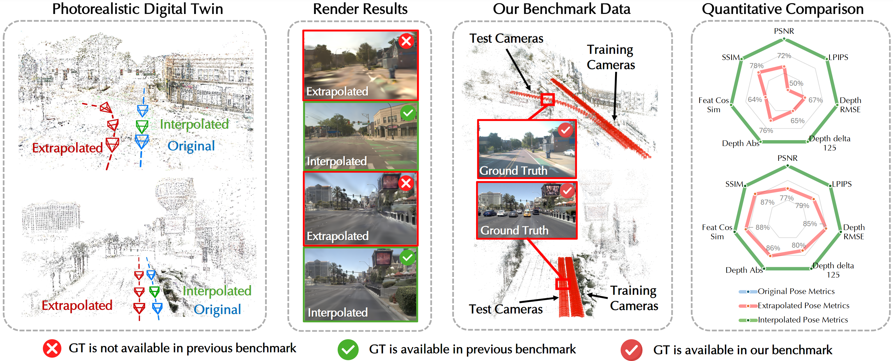

<div align="center">
<h1>Extrapolated Urban View Synthesis Benchmark <br> ICCV2025</h1>

[**Xiangyu Han**](https://han-xiangyu.github.io/)<sup>1, 3\*</sup> , [**Zhen Jia**](https://valentina0127.github.io/)<sup>1\*</sup> , [**Boyi Li**](https://sites.google.com/site/boyilics/)<sup>2</sup> , [**Yan Wang**](https://www.cs.cornell.edu/~yanwang/)<sup>2</sup><br>
[**Boris Ivanovic**](https://www.borisivanovic.com/)<sup>2</sup> , [**Yurong You**](https://yurongyou.com/)<sup>2</sup> , [**Lingjie Liu**](https://lingjie0206.github.io/)<sup>3</sup> , [**Yue Wang**](https://yuewang.xyz/)<sup>2, 4</sup>
<br>
[**Marco Pavone**](https://web.stanford.edu/~pavone/)<sup>2, 5</sup> , [**Chen Feng**](https://scholar.google.com/citations?user=YeG8ZM0AAAAJ)<sup>1</sup> , [**Yiming Li**](https://yimingli-page.github.io/)<sup>1, 2</sup>

<sup>1</sup>New York University&emsp;&emsp;&emsp;<sup>2</sup>NVIDIA &emsp;&emsp;&emsp;
<sup>3</sup>University of Pennsylvania&emsp;&emsp;&emsp;
<br>
<sup>4</sup>University of South California &emsp;&emsp;&emsp;
<sup>5</sup>Stanford University
<br>
*equal contribution

<a href="https://arxiv.org/pdf/2412.05256"></a>
<a href='https://ai4ce.github.io/EUVS-Benchmark/'></a>
<a href='https://huggingface.co/datasets/ai4ce/EUVS-Benchmark'></a>
</div>

## 
<p align="center">
    <!-- <video width="100%" controls>
        <source src="./assets/hospital.mp4" type="video/mp4">
        Your browser does not support the video tag.
    </video> -->
    
    <br>
    <em style="text-align: left;">TLDR: We build a comprehensive real-world benchmark for quantitatively and qualitatively evaluating extrapolated novel view synthesis in large-scale urban scenes.</em>
</p>


## 📖 Abstract

Photorealistic simulators are essential for the training and evaluation of vision-centric autonomous vehicles (AVs). At their core is Novel View Synthesis (NVS), a crucial capability that generates diverse unseen viewpoints to accommodate the broad and continuous pose distribution of AVs. Recent advances in radiance fields, such as 3D Gaussian Splatting, achieve photorealistic rendering at real-time speeds and have been widely used in modeling large-scale driving scenes. However, their performance is commonly evaluated using an interpolated setup with highly correlated training and test views. In contrast, extrapolation, where test views largely deviate from training views, remains underexplored, limiting progress in generalizable simulation technology. To address this gap, we leverage publicly available AV datasets with multiple traversals, multiple vehicles, and multiple cameras to build the first <strong>E</strong>xtrapolated <strong>U</strong>rban <strong>V</strong>iew <strong>S</strong>ynthesis (EUVS) benchmark. Meanwhile, we conduct quantitative and qualitative evaluations of state-of-the-art Gaussian Splatting methods across different difficulty levels. Our results show that Gaussian Splatting is prone to overfitting to training views. Besides, incorporating diffusion priors and improving geometry cannot fundamentally improve NVS under large view changes, highlighting the need for more robust approaches and large-scale training. We have released our data to help advance self-driving and urban robotics simulation technology.

## 🔊News
- 📅 2025/6/26: 🎉 Our paper has been **accepted to ICCV 2025**! Many thanks to all collaborators! 🙌
- 📅 2024/12/10: Our data is now available on [Hugging Face](https://huggingface.co/datasets/ai4ce/EUVS-Benchmark)!
- 📅 2024/12/9: Our paper is now available on [arXiv](https://arxiv.org/pdf/2412.05256)!


## Installation
We used multiple models and baselines. Please refer to the original repository for installation instructions and set up the necessary environments accordingly:
- [Ground SAM 2](https://github.com/IDEA-Research/Grounded-SAM-2)
- [3DGS](https://github.com/graphdeco-inria/gaussian-splatting)

Tip: We recommend using PyTorch 2.0.1 and CUDA 11.8 for all environments, as they work well in our implementation.

## Extract Masks
```shell
cd GroundedSAM2
conda activate groundsam

# Extract dynamic masks
python extract_masks.py --text-prompt "person. rider. car. truck. bus. train. motorcycle. bicycle." --input-dir <path to input_folder> --output-dir <path to output_folder>

# Extract sky masks
python extract_masks.py --text-prompt "sky." --input-dir <path to input_folder> --output-dir <path to output_folder>
```

Alternatively, you can run the Bash script [extract_masks.sh](./GroundedSAM2/extract_masks.sh) to process images across multiple folders.

## Data Structure
After extracting the masks, you'll find that the data structure is as follows:
```
<location>
|---test_set.txt
|---train_set.txt
|---images
|   |---<image 0>
|   |---<image 1>
|   |---...
|---sparse
    |---0
        |---cameras.bin
        |---images.bin
        |---points3D.bin
|---dynamic_masks
|   |---<image 0>
|   |---<image 1>
|   |---...
|---sky_masks
|   |---<image 0>
|   |---<image 1>
|   |---...
|---geo_registration
|   |---geo_registration.txt
|---poses
|   |---images.txt
```

## Run 3DGS

```shell
# Define the path
source_path="path/to/your/data"
model_path="$source_path/models/3DGS"

# Train 3DGS with masked dynamic objects
python train.py -s "$source_path" -m "$model_path" --method "masked_3dgs"
```
Note that this command run the 3DGS with masked dynamic objects. If you want run the vanila version, please use --method "vanila"

## Render
```shell
# Define the path
source_path="path/to/your/data"
model_path="$source_path/models/3DGS"

# Render
python render.py -m "$model_path"
```


## Evaluation
```shell
# Define the path
source_path="path/to/your/data"
model_path="$source_path/models/3DGS"

# Evaluation
python metrics_with_dyn_masks.py -s "$source_path" -m "$model_path" -e "all"
```

You can find the metrics as .txt file under the `$model_path` with a file name `test_set_results_w_mask.json` and `train_set_results_w_mask.json`. The output metrics will be like following:
```
{
 "ours_30000": {
  "SSIM": 0.7512373236681191,
  "PSNR": 16.235809601201545,
  "LPIPS": 0.4492570964361398,
  "Cos_Similarity": 0.4056943528884359
 }
}
```


## 🗓️ TODO
- [✔] Data release
- [✔] Code release (Will keep updating baselines)


## 📊 Baseline Code
Here are the official code links for the baseline. 

- [3DGS](https://github.com/graphdeco-inria/gaussian-splatting)
- [3DGM](https://github.com/NVlabs/3DGM)
- [GaussianPro](https://github.com/kcheng1021/GaussianPro)
- [VEGS](https://github.com/deepshwang/vegs)
- [PGSR](https://github.com/zju3dv/PGSR)
- [2DGS](https://github.com/hbb1/2d-gaussian-splatting)
- [feature 3DGS](https://github.com/ShijieZhou-UCLA/feature-3dgs)
- [Zip-NeRF](https://github.com/SuLvXiangXin/zipnerf-pytorch)
- [instant-NGP](https://github.com/NVlabs/instant-ngp)


## 🖊️ Citation
If you find this project useful in your research, please consider cite:

```BibTeX

@misc{han2024extrapolatedurbanviewsynthesis,
      title={Extrapolated Urban View Synthesis Benchmark}, 
      author={Xiangyu Han and Zhen Jia and Boyi Li and Yan Wang and Boris Ivanovic and Yurong You and Lingjie Liu and Yue Wang and Marco Pavone and Chen Feng and Yiming Li},
      year={2024},
      eprint={2412.05256},
      archivePrefix={arXiv},
      primaryClass={cs.CV},
      url={https://arxiv.org/abs/2412.05256}, 
}
```
